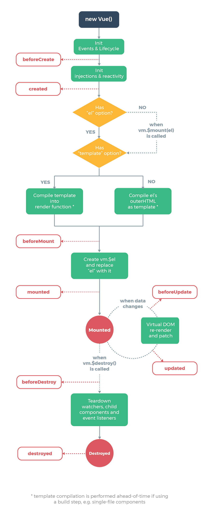
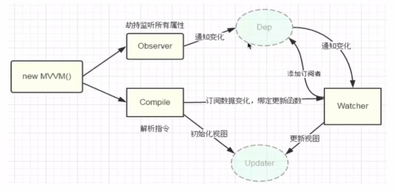
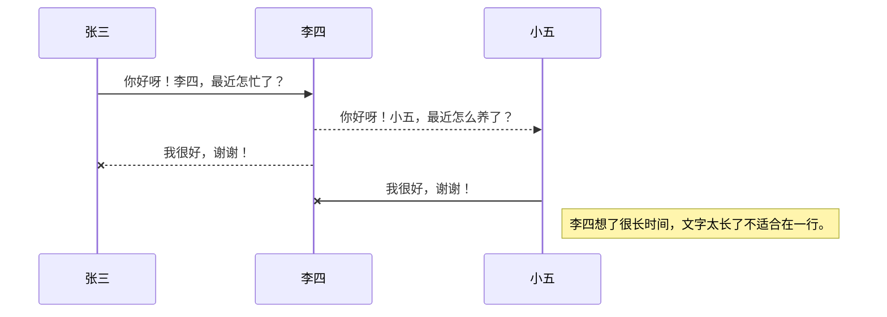
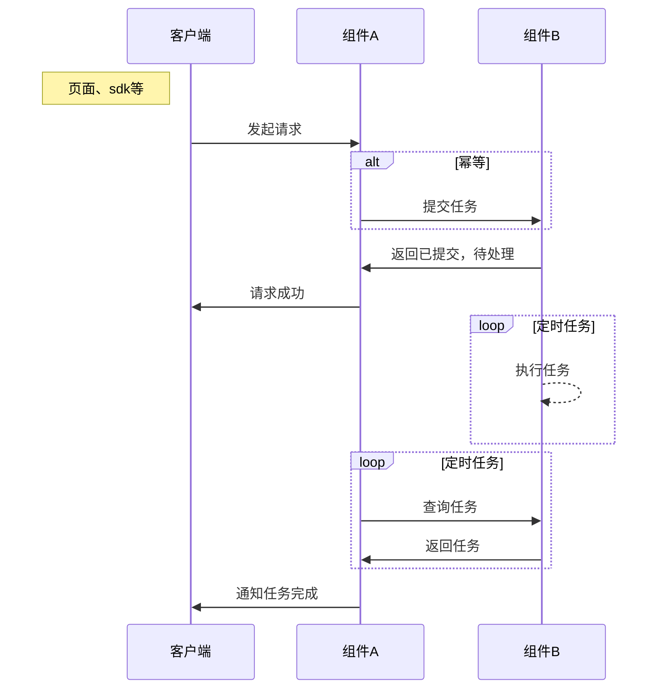

#### vue学习

##### (1)、前端框架和库的区别

* 在代码上的不同
  + 一般使用的库代码，就是调用库里面的的某个函数，为自己代码所用
  + 一般使用框架，就是帮我们运行自己所写的代码，
  	* 框架：初始化自身的一种行为
  		- 执行所编写的代码
  		- 使用框架内的各种api函数

##### (2)、Vue的起步
 
* 1、引爆
* 2、启动 new Vue(options);
* options 
	- 目的地el
	- 数据data保存数据属性
* 核心数据驱动视图

```html

<div id="app">
	<h3>{{msg}}</h3>
</div>
<script type="text/javascript" src="./vue.js"></script>
<script type="text/javascript">
	const vm = new Vue({
		el: '#app',
		//数据属性
		data: {
			msg: 'hello world',
			txt: 'hello', 
			msg2: 'content'
		},
		//存放的是方法
		methods:{
			getContent(){
				return this.msg + ' ' + this.msg2
			}
		}
	})
</script>
```


##### (3)、插值表达式

* {{表达式}}
	- 对象(不要连续3个{{ name:'jcak' }})
	- 字符串{{'xxx'}}
	- 判断后的布尔值 {{true}}
	- 三元表达式 {{ true?'正确':'错误' }}
* 可用于页面简单粗暴的测试

##### (4)、什么是指令

* 在vue中提供了一些对于页面+数据的更为方便的的输出	，这些操作就叫指令，以v-xxx表示
	- 比如html 页面的属性 `《div v-xxx》</div>`
* 比如在angular中以ng-xxx开头的就叫做指令
* 在vue中v-xxx开头的就叫做指令
* 指令中封装了一些DOM行为，结合属性作为一个暗号，暗号有对应的值，根据不同的值，框架会进行相关的DOM操作的绑定，

##### (5)、vue中常用的v-指令演示

* v-text:元素的innerText属性，必须是双标签，跟{{}}效果是一样的使用较少
* v-html:元素的innerHTML
* v-if:判断是否插入这个元素，相当于对元素的销毁和创建
	- 例子
		+ ```html
			
			<div id="app">
				<!-- <div v-if='Math.random() >0.5' > -->
				<div v-if='isShow' >
				显示
				</div>
				<div v-else>
					隐藏
				</div>
			</div>
			<script type="text/javascript" src="./vue.js"></script>
			<script type="text/javascript">
				//v-if v-else-if v-else v-show
				new Vue({
					el: '#app',
					data: {
						isShow: Math.random() > 0.5
					}
				})
			</script>
			```

* v-else-if
* v-else
* v-show  v-show和v-if都跟的布尔值 
	- v-show是通过修改css样式改变元素显示和隐藏，不管在什么条件下，元素总是会被渲染，并且只是简单的CSS进行切换
	- v-if则是真正的条件渲染，对元素进行销毁和创建。并且是惰性的：初始条件为假时，什么也不做，直到条件第一次变为真时，才会开始渲染条件块。
	- 一般来说，v-if具有更高的切换开销，而v-show则具有更高的初始渲染开销，频繁切换使用v-show，运行条件较少，建议使用v-if 


##### vue内变量的含义

```html

<div id="app">
		<h1>{{message}} </h1>
		<h1>{{name}} </h1>
		<!-- {{ message }} //显示数据 ，解析script 标签下vue元素内定义的值 -->
</div>
<script type="text/javascript">
	// let变量、const常量
	// 编程成名范式（声明式编程）
	var app = new Vue{
		el: '#app', //el用于挂在要管理的元素
		data:  {//定义数据
		message: 'hello word!',
		name: 'liky'
		}
	}
	</script>
```


```javascript
	var app = new Vue{
	el: '#app', //el用于挂在要管理的元素
	data:  {//定义数据
	message: 'hello word!',
	name: 'liky'
	},
	methods: {   // app实例三个属性  el挂载元素， data定时数据， methods 定义方法函数
	}

}
```

###### vue指令的使用方法

* 学习v-for的使用  {可以遍历 vue数据中列表元素}，响应式的改变 	、
	- v-for 列表遍历  （有表达式）`< li v-for = '(item,index) in menus'>id:{{item.id}} 名字:{{item.name}} </li>` 遍历menus中的各项元素
	- 例如
	- `
			data：{
			menus:[
				{id:1,name:'aaa'},
				{id:2,name:'bbb'},
				{id:3,name:'ccc'},
				{id:4,name:'ddd'}
			]
		}
		`
* v-on   数据监听  （有：属性）提供事件修饰符
	- 提供事件修饰符
		+ .stop 阻止事件继续传播 `<a v-on:click.stop = 'doThis'></a>`
		+ .prevent 提交时间不再重载页面 `<form v-on:submit.prevent = 'onSubmint'></form>`
		+ .capture
		+ .self
		+ .once 事件只触发一次<a v-on:click.once = 'doThis'></a>
		+ .passive
		+ v-once 固定指令不会改变（无表达式
	- 提供按键修饰符 `<input v-on:keyup.13 = 'submit'> ` 为了支持大部分旧版本的浏览器
		+ .enter
		+ .tab
		+ .delete  捕获删除和退格键
		+ .esc
		+ .space
		+ .up
		+ .down
		+ .left
		+ .right
		
* v-html  解析html网址 用于插入`<p>hhaa</p>`标签，转换成html元素，渲染到页面
		类似`htmlmsg： '<h1>hahhaha</h1>' 使用<div v-html='htmlmsg'> </div> `渲染，

* v-text  用法`v-text=’message‘` 一般不用， 插入标签 和{{}} 作用是一样的，

* v-pre  用法 `v-pre {{message}}` 原封不动的展示出来 不做解析

* v-cloak  可以添加style 在div标签 中添加v-cloak 基本上不用

* v-if和v-else 作为选择是否执行，将不需要执行的语句直接从DOM中移除
	- 注：v-if是真正的条件渲染，它能确保在切换过程中条件块内的事件监听器和子组件适当的被销毁和重建。是具有惰性的，如果初始渲染的条件为假，则什么也不做，一直到条件第一次变为真，
	- 相比之下v-show就比较简单，无论条件如何，元素都会渲染，只是简单的基于css的切换，
	- 一般来说v-is具有更高的开销，v-show 具有更高的初始渲染开销，如果非常频繁切换 使用v-show 更好，在运行时条件很少改变，使用 v-if。
	- v-show可改变DOM的style样式，


##### 实例

```html
	<div id="app">
		<div v-if = 'isShow'>
			显示
		</div>
		<div v-else> 
		隐藏
		</div>
		<h1 v-show = 'isBoolean'>嘿嘿嘿</h1>
	</div>
<script>
	new Vue({
		el: '#app',
		data: {
			isShow: Matn.random() > 0.5,
			isBoolean: true
		}
	})
 // 页面会根据表达式的内容进行选择

```

=========================================  
#### v-bind和v-on介绍

* v-bind主要将值插入模板属性当中  动态绑定
	- 用于绑定一个或多个属性值，或者向另一个组件传递props值可以通过Vue实例中的data绑定元素的src和href
* v-on 使用方法
	- 用于监听点击事件  v-on：click   语法糖 **\@click**  
	- 用于监听DOM事件，并在触发事件时执行相应的方法或逻辑。v-on的作用是将事件与Vue实例中的进行绑定，实现事件处理和响应。  
* v-bind使用方法  
	+ v-bind：src=“---------------”  
	+ 语法糖 ：src=“---------------”
 
##### v-bind动态绑定class 属性

* `v-bind：class=“{类名1：boolean，类名2：boolean}”`

```html
	<div id="app">
		<h1 v-bind:class="{active,IsActive,line:Is}">{{message}}</h1>
		<button v-on:btnclick>按钮</button>
	</div>
	<script type="text/javascript">
		var app = new Vue({
			el: '#app',
			data: {
				message: '你好呀',
				IsActive: true,
				IsLine: true
			},
			methods: {
				btnclick: function (){
					this.IsActive = !this.IsActive
				}
			}
		})
	</script>

```

##### v-bind 绑定style
* 在写css样式的时候，比如font-size等需要修改可以使用驼峰式fontSize或者 ’font-size‘  
* 绑定class有两种方式
	- 对象语法 `:style='{key-元素的属性名：value-属性值单引号隔开}'`
	- 数组语法  
```javascript
	var app = new Vue({
		el: '#app',
		data: {
			message: '哈哈'
		},
		methods: {
			getFullName() {
				return this.firstName+''+this.lastNmae
			}
		}
	})
```

* 1、绑定单个事件
* 2、绑定多个事件 `v-on:属性={事件1,事件2}`


##### v-model 数据双向绑定

* 表单数据双向绑定

```html

	<div id="app">
		<p>{{msg}}</p>
		<input type="text" v-model='msg' >
	</div>
	<script type="text/javascript" src="./vue.js"></script>
	<script type="text/javascript">
		new Vue({
			el: '#app',
			data: {
				msg: 'hahhaa'
			},
			methods: ()
		})
	</script>
	<!-- 	在input中可修改msg的原始数据 数据-》视图 --> 
```

* 复选框数据绑定

```html
	<div id="app">
		<!-- 复选框单选 -->
		<label for="checkbox" id="checkbox">{{checked}}</label>
		<input type="checkbox" id="checkbox" v-model='checked'>
	</div>

	<script type="text/javascript" src="./vue.js"></script>
	<script type="text/javascript">
		new Vue({
			el: '#app',
			data: {
				msg: 'hahha',
				checked: false
			},
			methods: ()
		})
	</script>
```

##### 监听器watch


* 监听数据的变化

```html
  <script type="text/javascript" src="./vue初步/vue.js"></script>
  <div id="app">
    <input type="text" v-model='msg'>
    <h3>{{msg}} </h3>
  </div>
	  <script type="text/javascript">
    new Vue({
      el: '#app',
      data: {
        msg: ''
      },
      key属于data对象的属性名 value监听后的行为 newV新值 oldV表示之前的旧值
      watch: {
        'msg': function(newV,oldV){
          console.log(newV,oldV)
        }
      }
    })
  </script>
  <!-- 将原有的methds改为watch  -->

```

* 监听计算属性computed 使用方法如下

```html

<script type="text/javascript">
	new Vue({
		el: '#app',
		data: {
			msg: 'hello world'
		},
		methods: {

		},
		// computed 默认只有getter方法
		// 计算属性最大的优点：产生缓存，如果数据没有发生变化，直接从缓存中取
		computed: {
		reverseMsg:function(){
			return this.msg.split('').reverse().join('')
			}
		}		
	})

</script>

```

* 计算属性 computed 下content包含 get()和set()方法

```html
	<div id= 'app'>
		{{content}}
		<input type="text" v-model='content' @input = 'handleInput' >
		<button @click='handleClick'>提交</button>
	</div>	

<script type="text/javascript">
	new Vue({
		el: '#app',
		data: {
			msg: '',
		},
		methods: {
			handleInput: function(event){
				const {value} = even t.targe;
				this.content = value;
			},
			handleClick(){
				if (this.content){
				console.log(this.content)					
			}
			}
		},
		computed: {
			content: {
				set: function(newV){
					this.mag = newV;
				},
				get: function(){
					return this.msg;
				}
			}
		}
	})
</script>

```

* 过滤器 vue.fitter()

#### MVVM
	-            ViewModel 
	-           Dom listeners
	-     ----------->-----------   
	- view      Data bindings      Model
	-   | -----------<-----------    |     
	-   |            |               |
	-  DOM          Vue     Plains Javascript Objects


### 具体内涵

+ ■ Vue层
	* 》 视图层
	* 》 在前端开发中，通常就是DOM层
	* 》 主要的作用就是给用户展示各种信息。
+ ■ Model层
	* 》 数据层
	* 》 可能是固定的死数据，更多的来自服务器，从网络请求下载的数据
	* 》 在计数器案例中，就是被抽调出来的obj，
+ ■ ViewModel
	* 》 视图模型层
	* 》 视图模型层是View和Model沟通的渠道
	* 》 一方面实现了Data Binding，也就是双向绑定，将model的改变实时的反映到view中，
	* 》 另一方面实现了DOM Listener，也就是DOM监听，当DOM发生一些事件（点击，滚动，touch等）可以监听带，并在需要的情况下改变对应的Data

##### vue组件化开发

* 全局组件：可以在任意地方使用 全局组件的创建需要	`Vue.compontent('xxx',{template}:{})`
* 局部组件：只在当前组件加载的时候才会加载局部组件,需要在contents里面进行挂载 创建方式`const XXX = {data(){return {}},template: `html标签`}`，

##### 组件之间的通信

* 1、父传子 通信主要用到 `props['子']`
* 2、子传父 通信主要用到 `this.$emit('绑定的父组件事件',value)` 来触发自定义事件
* 3、平行通讯传值  A和B属于平行组件  通过点击A获取+1 传给B ： 可以在B中绑定 `$on('事件',()=>{})` 在A中接收绑定的事件`$emit('事件',value)` 进行传值,注需要创建公共组件`const bus = new Vue()`
* 4、通信 使用provide 和 inject 
	- 父组件通过 provide 提供变量 `provide(){return {msg:'老爹数据'}}` 是一个函数
	- 子组件中通过inject来注入变量，`inject:['msg']` 是一个数组 若方法要使用则`this.msg`,模板使用 直接`{{msg}}`
	- 无论组件嵌套的多深
	- 且可以在其子组件中通过 created 中的$parent 拿到其父组件


#### 创建Vue实例传入对象options

* 目前的选项
	+ el：
		* 类型： string | HTMLElement
		* 作用： 决定之后的vue案例会管理哪一个DOM
	+ data：
		* 类型： Object | Function（组件当中data 必须是一个函数）
		* 作用： Vue实例对应的数据对象
	+ methods
		* 类型： {【key,name】:Function}
		* 作用： 定义属于Vue的一些方法，可以在其他地方调用，也可以在指令中使用

##### vue的一个盛名周期



##### mustache 语法 “{{ }}” 双大括号

##### 几种数据双向绑定的方法

>1、发布者-订阅模式（backbone.js）<br>
>2、脏值检查（argular.js）<br>
>3、数据劫持（vue.js）

**发布者-订阅模式：**一般是通过sub，pub方式实现数据和视图的绑定监听，更新数据方式通常的做法是`vm.set('propety',value)`

**脏值检查（argular.js）：**是通过脏值检测的方式比对数据是否有变更，来决定是否更新视图，最简单的的方式是通过`setInterval（）`定时轮询检测数据变动，argular只是在指定的事件触发时进入脏值检测，大致如下：

* DOM事件，譬如用户输入文本，点击按钮等，（ng-click）
* XHR响应事件（$http）
* 浏览器Location变更事件（$location）
* Timer事件（$timeout,$initerval）
* 执行$digest()或$apply()

**数据劫持：**vue.js则是采用数据劫持结合发布者-订阅者模式的方式，通过`Object.defineProperty()`来劫持各个属性的`setter`，`getter`，在数据变动时发布消息给订阅者，触发响应的监听回调。



**面试题流程**

* **实现一个指令解析器Compile**
* **实现一个数据监听器Observer**
* **实现一个watcher去更新视图**
* **实现一个proxy**

**阐述一下你所理解的MVVM响应式原理**

* Vue是采用数据劫持配合发布者-订阅 模式的方式，通过`Object.definerProperty()`来劫持各个属性的setter和getter，在数据变动时，发布消息给依赖收集器，	去通知观察者，做出对应的回调函数，去更新视图，
* MVVM作为绑定的入口，整合Observer，Compile和Watcher三者，通过Observer来监听model数据变化，通过Compile来解析编译模块指令，最终利用Watcher搭起Observer，Compile之间的通信桥梁，达到数据变化=> 视图更新；视图交互变化=> 数据model变更的双向绑定效果。




#### 

